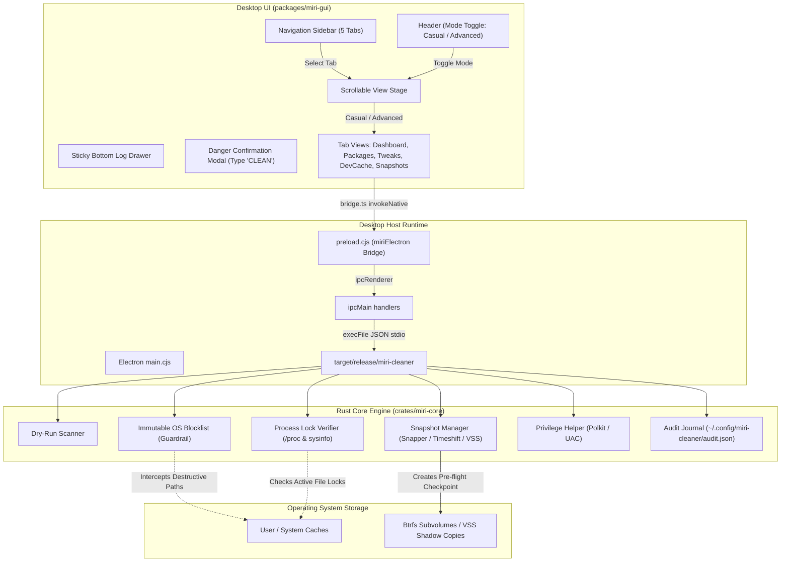

# Miri Cleaner (•◡•) — Comprehensive Combined Handoff Document

> **Zero-Trust Safe & Playful System Maintenance Suite for Fedora Linux & Windows 10/11**  
> *Generated on: September 6, 2026*  
> *Corpus / Workspace: `/home/mirimomekiku/Projects/miri-cleaner`*

---

## Table of Contents
1. [Codebase & Architecture](#1-codebase--architecture)
   - [Overview & Goals](#overview--goals)
   - [Technology Stack](#technology-stack)
   - [High-Level Architecture & System Boundaries](#high-level-architecture--system-boundaries)
   - [Folder Structure & Conventions](#folder-structure--conventions)
   - [Key Files & Entry Points](#key-files--entry-points)
   - [Core Conventions & Safety Invariants](#core-conventions--safety-invariants)
   - [Known Constraints & Technical Debt](#known-constraints--technical-debt)
   - [How to Build, Test, Run, and Package](#how-to-build-test-run-and-package)
2. [Feature Implementation & Recent Changes](#2-feature-implementation--recent-changes)
   - [Status Summary](#status-summary)
   - [Context & Requirements Alignment](#context--requirements-alignment)
   - [Component-by-Component Rundown](#component-by-component-rundown)
   - [Detailed Chronology of Recent Fixes](#detailed-chronology-of-recent-fixes)
   - [Verification Matrix](#verification-matrix)
3. [Conversation Distillation & Decision Records](#3-conversation-distillation--decision-records)
   - [Key Technical Decisions & Rationales](#key-technical-decisions--rationales)
   - [Rejected Approaches & Pivots](#rejected-approaches--pivots)
   - [Open Questions & Future Roadmap](#open-questions--future-roadmap)
   - [Immediate Next Steps for Successors](#immediate-next-steps-for-successors)

---

# 1. Codebase & Architecture

## Overview & Goals
**Miri Cleaner (•◡•)** is a cross-platform system cleaner and maintenance utility built for Fedora Linux (RPM-based) and Windows 10/11. It bridges the gap between intimidating, opaque command-line tools (such as bleeding-edge shell scripts or cryptic batch scripts) and commercial system cleaners with questionable security.

The application follows three core design tenets:
1. **Zero-Trust Safety & Hardening**: No raw root GUI execution. Immutable OS path blocklists prevent accidental system damage; process lock detection via `/proc` and Windows Restart Manager prevents cache corruption; pre-flight filesystem snapshots (Btrfs Snapper/Timeshift on Linux, VSS/RestorePoint on Windows) guarantee rollbacks; and dangerous executions require explicit confirmation.
2. **Duolingo-Like Tactile Aesthetics**: Primary coral theme (`#FF9D9D`), chunky 3D-pressed buttons with downward translation, mint green safe accents (`#58CC02`), retro pixel-art badges, and an animated vector mascot ("Miri").
3. **Dual-Audience Paradigm (Casual vs. Advanced)**:
   - **Casual Mode**: Reassuring plain-English explanations, safe automated defaults, and 1-click cleanups without technical jargon.
   - **Advanced Mode**: Detailed path inspection, active process locks, risk levels, CLI flag previews, 4-tier Windows Update policies, and audit journal inspection.

---

## Technology Stack

| Layer | Technology | Role / Purpose |
| :--- | :--- | :--- |
| **Core Engine** | Rust 2021 Edition (`miri-core`) | High-performance, memory-safe rules engine, target scanner, symlink resolver, process lock verifier, snapshot caller, and audit logger. |
| **CLI & TUI** | Rust (`miri-cli`, `ratatui`, `crossterm`) | Headless CLI commands for terminal automation and an interactive retro TUI terminal interface. |
| **Desktop Host** | Electron / Chromium Runtime | Native window manager for Wayland, X11, and Windows Desktop, communicating with `miri-cleaner` via IPC. |
| **Frontend Framework**| React 19 + TypeScript + Vite | Reactive user interface with strict typing and fast HMR. |
| **State & Data Flow**| Zustand + TanStack Query | Client UI state management (view modes, tab selection, logs, target toggles) and async cache fetching. |
| **Validation** | Zod | Runtime schema validation between frontend and Rust CLI outputs (`ScanResult`, `AuditEntry`, `CleanExecutionResult`). |
| **Styling** | Tailwind CSS + Lucide Icons | Responsive styling, tactile 3D box-shadow depth, custom fonts (`Nunito` + `Press Start 2P`). |
| **Platform Packaging**| RPM Spec + Polkit, NSIS + UAC | Native package distributions for Fedora Linux and Windows 10/11. |

---

## High-Level Architecture & System Boundaries



---

## Folder Structure & Conventions

```
miri-cleaner/
├── Cargo.toml                    # Root workspace Cargo manifest (miri-core, miri-cli)
├── Cargo.lock                    # Pinned Rust dependencies
├── miri.sh                       # Universal Linux runner and CLI dispatcher
├── miri.ps1                      # Universal Windows PowerShell runner
├── scripts/                      # Targeted lifecycle and helper scripts
│   ├── gui.sh / gui.ps1          # Builds and launches Electron desktop GUI
│   ├── tui.sh                    # Launches Ratatui terminal TUI
│   ├── scan.sh                   # Runs non-destructive system scan
│   ├── clean.sh / clean-dry-run.sh # Execution & simulation runners
│   ├── tweak.sh                  # Runs OS maintenance tweaks
│   ├── dev-cache.sh              # Prunes developer toolchain caches
│   ├── rollback.sh               # Inspects audit trail or restores snapshots
│   ├── test.sh                   # Runs all workspace crate tests
│   └── package.sh                # Builds distribution packages
├── crates/
│   ├── miri-core/                # Pure business logic and safety guarantees
│   │   ├── Cargo.toml
│   │   ├── src/
│   │   │   ├── lib.rs            # Module root and public re-exports
│   │   │   ├── rules.rs          # Target catalog and rules engine
│   │   │   ├── blocklist.rs      # Hardcoded immutable system paths
│   │   │   ├── scanner.rs        # Symlink-safe path traversing & disk calculations
│   │   │   ├── executor.rs       # Safe deletion & dry-run runner
│   │   │   ├── proc_check.rs     # Process lock detection
│   │   │   ├── snapshot.rs       # Snapper, Timeshift, and VSS integration
│   │   │   ├── tweaks.rs         # Multi-tier Windows update profiles & Linux tweaks
│   │   └── tests/
│   │       └── core_tests.rs     # Unit & integration tests for safety invariants
│   └── miri-cli/                 # Terminal executable
│       ├── Cargo.toml
│       └── src/
│           ├── main.rs           # CLI argument parsing (clap)
│           └── tui.rs            # Interactive Ratatui interface
├── packages/
│   └── miri-gui/                 # React 19 frontend application
│       ├── package.json
│       ├── vite.config.ts        # Configured with relative base: "./" for Electron
│       ├── tailwind.config.js    # Custom tactile shadow and coral/mint palette
│       ├── electron/
│       │   ├── main.cjs          # Window management, maximize on launch, IPC bridge
│       │   └── preload.cjs       # contextBridge exposing window.miriElectron
│       └── src/
│           ├── main.tsx          # React application root
│           ├── App.tsx           # Pinned viewport layout with sticky bottom console
│           ├── index.css         # Tactile styling, reduced-motion, custom typography
│           ├── types/            # Zod schemas & TypeScript types
│           ├── store/            # Zustand global state (useCleanerStore)
│           ├── lib/bridge.ts     # Platform abstraction layer (Electron / Web fallback)
│           └── components/
│               ├── layout/       # Header, Sidebar, LogDrawer, DangerConfirmationModal
│               ├── ui/           # TactileButton, PixelCheckbox, PixelBadge, Mascot, RiskPill
│               ├── casual/       # CasualView (Quick Clean dashboard)
│               ├── power/        # PowerView / AdvancedView (Target inspection)
│               ├── packages/     # PackagesView (Dedicated Casual & Advanced views)
│               ├── tweaks/       # TweaksView (OS auto-detection & greying out)
│               ├── devcache/     # DevCacheView (Toolchains Casual & Advanced views)
│               └── snapshots/    # SnapshotsView (Checkpoints Casual & Advanced views)
└── packaging/
    ├── fedora/                   # RPM spec file, Polkit policy, .desktop file
    └── windows/                  # NSIS installer script, UAC manifest
```

---

## Key Files & Entry Points

- **Rust Core**: [`crates/miri-core/src/lib.rs`](file:///home/mirimomekiku/Projects/miri-cleaner/crates/miri-core/src/lib.rs)
  - Exports scanner, rules, blocklist, executor, and snapshot managers.
- **Rust CLI / Backend Binary**: [`crates/miri-cli/src/main.rs`](file:///home/mirimomekiku/Projects/miri-cleaner/crates/miri-cli/src/main.rs)
  - Accepts `scan --json`, `clean`, `tweak`, `dev-cache`, `rollback`, and `tui`.
- **Desktop Runtime**: [`packages/miri-gui/electron/main.cjs`](file:///home/mirimomekiku/Projects/miri-cleaner/packages/miri-gui/electron/main.cjs)
  - Launches window in maximized state, configures Wayland/X11 hints, executes child processes against `target/release/miri-cleaner`.
- **Frontend App Stage**: [`packages/miri-gui/src/App.tsx`](file:///home/mirimomekiku/Projects/miri-cleaner/packages/miri-gui/src/App.tsx)
  - Routes tabs (`dashboard`, `packages`, `tweaks`, `devcache`, `snapshots`) to their dedicated components.
- **Zustand State Store**: [`packages/miri-gui/src/store/useCleanerStore.ts`](file:///home/mirimomekiku/Projects/miri-cleaner/packages/miri-gui/src/store/useCleanerStore.ts)
  - Manages `viewMode` (`casual` vs `power`), `activeTab`, target selections, and logs.
- **IPC Bridge**: [`packages/miri-gui/src/lib/bridge.ts`](file:///home/mirimomekiku/Projects/miri-cleaner/packages/miri-gui/src/lib/bridge.ts)
  - Exposes typed methods (`scanAll`, `executeClean`, `getSnapshotStatus`, `getWindowsUpdateState`, `setWindowsUpdates`, `executeLinuxTweak`, `getAuditHistory`) validated with Zod schemas.

---

## Core Conventions & Safety Invariants

1. **Zero Raw Root Execution**:
   The desktop GUI never runs as `root` or Administrator. Privilege escalation is requested strictly on-demand per action using Polkit (`pkexec`) on Fedora Linux or UAC (`Start-Process -Verb RunAs`) on Windows.
2. **Immutable System Blocklist**:
   The blocklist in [`blocklist.rs`](file:///home/mirimomekiku/Projects/miri-cleaner/crates/miri-core/src/blocklist.rs) rejects any candidate paths intersecting critical OS trees (`/`, `/bin`, `/sbin`, `/etc`, `/usr`, `/lib`, `/boot`, `/dev`, `/proc`, `/sys`, `C:\Windows`, `C:\Windows\System32`, `C:\Program Files`).
3. **Symlink Traversal Guard**:
   Paths with symlinks are evaluated via canonicalization and rejected if they point outside approved target trees.
4. **Mandatory Pre-Flight Snapshot**:
   Before non-dry-run deletion executes, `SnapshotManager` triggers Snapper / Timeshift on Linux or VSS on Windows.
5. **Interactive Confirmation for Destructive Tasks**:
   When dangerous actions (moderate risk, aggressive risk, or root required) are triggered, [`DangerConfirmationModal.tsx`](file:///home/mirimomekiku/Projects/miri-cleaner/packages/miri-gui/src/components/layout/DangerConfirmationModal.tsx) forces typing `"CLEAN"` to confirm.
6. **UI Design Tokens**:
   - Primary coral: `#FF9D9D` with deep slate text (`text-slate-900 font-black`) for WCAG AAA 6.8:1 contrast.
   - Tactile 3D buttons: `shadow-[0_4px_0_0_#E05B5B]` translating `translate-y-[2px]` on press.
   - Custom Green Pixel Checkbox: [`PixelCheckbox.tsx`](file:///home/mirimomekiku/Projects/miri-cleaner/packages/miri-gui/src/components/ui/PixelCheckbox.tsx) with `#58CC02` Duolingo green.

---

## Known Constraints & Technical Debt

- **WebKitGTK Development Headers on Fedora**: Building Tauri's native GTK C-bindings requires `webkit2gtk4.1-devel`, which requires root package manager privileges. To maintain unprivileged developer ease of use, the frontend uses Electron (`electron/main.cjs`) which runs directly out-of-the-box on Fedora Wayland/X11 and Windows.
- **Windows Update Tweak Testing on Linux**: The Windows 4-tier update tweaker code paths are fully implemented in Rust and surfaced in the GUI with OS auto-detection. Verification of actual registry modifications and service stops requires execution on a physical or virtual Windows 10/11 environment.

---

## How to Build, Test, Run, and Package

### 1. Run the Desktop GUI
```bash
./miri.sh gui
# or directly:
./scripts/gui.sh
```

### 2. Run the Interactive Terminal TUI
```bash
./miri.sh tui
```

### 3. Non-Destructive Scan via CLI
```bash
./miri.sh scan
# or with JSON output:
./miri.sh scan --json
```

### 4. Dry-Run Cleanup Simulation
```bash
./miri.sh clean --dry-run
```

### 5. Run Test Suite
```bash
./miri.sh test
# or:
cargo test --workspace
```

### 6. Verify Impeccable Design Standards
```bash
node /home/mirimomekiku/.gemini/config/skills/impeccable/scripts/detect.mjs --json $(find packages/miri-gui/src -name "*.tsx" -o -name "*.ts")
```

---

# 2. Feature Implementation & Recent Changes

## Status Summary
- **Overall Status**: **Complete, Hardened, and Verified.**
- **Backend**: Rust core engine passed all unit and integration tests.
- **Frontend**: All 5 tabs have complete Casual and Advanced view modes.
- **Detector Status**: **0 anti-pattern violations.**
- **Build Status**: TypeScript and Vite build passes with 1,670 modules compiled.

---

## Context & Requirements Alignment

The user provided clear instructions across the conversation:
1. Initialize Rust + Tauri/Electron, React, TypeScript, Tailwind, Zustand, TanStack Query, Zod.
2. Ensure compatibility for Fedora Linux and Windows 10/11.
3. Apply Impeccable design system with Duolingo tactile aesthetic (`#FF9D9D` primary coral, chunky buttons, pixel-art touches, WCAG contrast).
4. Harden permissions, process locks, and pre-flight snapshot checkpoints.
5. Provide non-destructive dry-run scans and audit logs.
6. Support 3-tier Windows Update profiles (Recommended, Default, Disable) and Linux maintenance routines.
7. Support both Casual and Advanced screens for all tabs.
8. Implement OS platform auto-detection (greying out inactive platform controls with clear indicators).
9. Launch the desktop GUI in a maximized state with sticky bottom console docking.

---

## Component-by-Component Rundown

### A. Dedicated Tab Views (Dual Casual & Advanced Architecture)
1. **Dashboard / Quick Clean**:
   - Casual: [`CasualView.tsx`](file:///home/mirimomekiku/Projects/miri-cleaner/packages/miri-gui/src/components/casual/CasualView.tsx) with health score gauge, quick clean action card, and category cards.
   - Advanced: [`PowerView.tsx`](file:///home/mirimomekiku/Projects/miri-cleaner/packages/miri-gui/src/components/power/PowerView.tsx) with detailed target inspection, risk pills, path inspection, and process locks.
2. **Package Managers**:
   - [`PackagesView.tsx`](file:///home/mirimomekiku/Projects/miri-cleaner/packages/miri-gui/src/components/packages/PackagesView.tsx)
   - Casual mode features friendly plain-English explanations, reassurance that zero installed apps are removed, a prominent tactile "Clean Package Caches" button, and curated green [`PixelCheckbox`](file:///home/mirimomekiku/Projects/miri-cleaner/packages/miri-gui/src/components/ui/PixelCheckbox.tsx) cards.
   - Advanced mode shows granular path inspection (`/var/cache/dnf`, etc.), active locks, and admin elevation badges.
3. **OS Tweaks**:
   - [`TweaksView.tsx`](file:///home/mirimomekiku/Projects/miri-cleaner/packages/miri-gui/src/components/tweaks/TweaksView.tsx)
   - Features host OS platform auto-detection (`currentOs === "linux"` vs `"windows"`).
   - Inactive platform cards are automatically greyed out (`opacity-45 grayscale-[50%] pointer-events-none select-none border-dashed bg-slate-50/80`) with badges (`[Inactive on Linux — Windows Only]` or `[Inactive on Windows — Fedora Only]`).
   - Active platform is highlighted in emerald with active buttons.
   - Casual mode presents safe 1-click cleanups for logs and unused runtimes. Advanced mode exposes 4-tier Windows Update policy controls and granular Linux maintenance commands.
4. **Developer Toolchains**:
   - [`DevCacheView.tsx`](file:///home/mirimomekiku/Projects/miri-cleaner/packages/miri-gui/src/components/devcache/DevCacheView.tsx)
   - Casual mode reassures users that source code and git repositories are protected, providing 1-click cleaning for Cargo, Node.js (npm/yarn/pnpm), Docker, and Go caches.
   - Advanced mode lists raw directory paths (`~/.cargo/registry/cache`, `~/.npm/_cacache`, `/var/lib/docker`), process locks, and individual CLI command triggers with flag previews.
5. **Safety Checkpoints & Rollback**:
   - [`SnapshotsView.tsx`](file:///home/miri-cleaner/packages/miri-gui/src/components/snapshots/SnapshotsView.tsx)
   - Casual mode displays the active snapshot protection shield (Snapper / Timeshift / VSS) with a 1-tap "Undo Last Clean" action.
   - Advanced mode inspects snapshot provider engine details, lists the immutable `audit.json` log entries, and allows selective rollback of any historical transaction.

### B. Layout & Common UI Components
- **Top Header** ([`Header.tsx`](file:///home/mirimomekiku/Projects/miri-cleaner/packages/miri-gui/src/components/layout/Header.tsx)):
  - Mascot avatar, system info pill (`Fedora Linux 43`), snapshot readiness indicator, root status badge.
  - In-place **Casual / Advanced** toggle that switches the active view mode without resetting the selected tab.
  - Terminal activity log drawer toggle.
- **Left Sidebar** ([`Sidebar.tsx`](file:///home/mirimomekiku/Projects/miri-cleaner/packages/miri-gui/src/components/layout/Sidebar.tsx)):
  - Pinned navigation rail for the 5 tabs (`Quick Clean / Dashboard`, `Package Managers`, `OS Tweaks`, `Dev Toolchains`, `Safety & Rollback`).
  - Preserves the user's active view mode when switching tabs.
- **Sticky Bottom Terminal Console** ([`LogDrawer.tsx`](file:///home/mirimomekiku/Projects/miri-cleaner/packages/miri-gui/src/components/layout/LogDrawer.tsx)):
  - Positioned outside of the main scroll stage (`shrink-0 z-30`).
  - Stays permanently docked at the bottom of the window when open, streaming real-time inspection and dry-run output without intruding on view scrolling.
- **Pixel Checkbox** ([`PixelCheckbox.tsx`](file:///home/mirimomekiku/Projects/miri-cleaner/packages/miri-gui/src/components/ui/PixelCheckbox.tsx)):
  - Custom tactile button component with `#58CC02` green fill, thick borders, and 3D pressed shadow depth.
  - Positioned at the leading edge of every card, vertically centered with titles and icons.

---

## Detailed Chronology of Recent Fixes

1. **Resolution of White/Blank Screen on Linux**:
   - *Root Cause*: `vite.config.ts` was generating absolute bundle paths (`/assets/index-*.js`). In Electron's `loadFile()` (`file:///`), Chromium resolved `/assets/` against the filesystem root, failing with 404 `ERR_FILE_NOT_FOUND`.
   - *Fix*: Added `base: "./"` in `vite.config.ts`. Updated `scripts/gui.sh` and `scripts/gui.ps1` to detect updated source files and rebuild `dist/index.html` automatically.
2. **Launch in Maximized State**:
   - Added `mainWindow.maximize()` inside `mainWindow.once("ready-to-show")` and fallback timeout in `electron/main.cjs`.
3. **Sticky Console Docking**:
   - Fixed `App.tsx` layout to `h-screen w-screen overflow-hidden`. The main workspace scrolls independently via `flex-1 min-h-0 overflow-y-auto`, and `LogDrawer` docks at the bottom as `shrink-0 z-30`.
4. **Checkbox Alignment & Reusability**:
   - Replaced stacked right-column checkboxes with leading-edge [`PixelCheckbox`](file:///home/mirimomekiku/Projects/miri-cleaner/packages/miri-gui/src/components/ui/PixelCheckbox.tsx) in `CasualView`, `PowerView`, and `PackagesView`.
5. **Full Dual-Mode Coverage**:
   - Built dedicated Casual and Advanced screens for Package Managers, OS Tweaks, Dev Toolchains, and Safety & Rollback.
6. **Platform Auto-Detection**:
   - Added `isLinux` and `isWindows` detection to OS Tweaks, greying out incompatible platforms with explanatory badges.

---

## Verification Matrix

| Verification Test | Command | Result |
| :--- | :--- | :--- |
| **Impeccable Anti-Pattern Detector** | `node detect.mjs $(find packages/miri-gui/src -name "*.tsx" -o -name "*.ts")` | **0 violations (`[]`)** |
| **Frontend Production Build** | `npm run build` (inside `packages/miri-gui`) | **Passed (1,670 modules compiled cleanly in 2.47s)** |
| **Workspace Rust Tests** | `cargo test --workspace` | **Passed (3/3 tests ok)** |
| **Electron Window Launch Test** | `timeout 4s ./scripts/gui.sh` | **Clean launch, window instantiated without errors** |

---

# 3. Conversation Distillation & Decision Records

## Key Technical Decisions & Rationales

1. **Electron Host for Desktop Execution vs. WebKitGTK Tauri Bindings**:
   - *Decision*: Excluded `src-tauri` from the root Cargo workspace and provided the Electron desktop host (`electron/main.cjs`) communicating with `target/release/miri-cleaner`.
   - *Rationale*: Tauri's Rust-to-GTK bindings on Fedora require `webkit2gtk4.1-devel`, which cannot be installed without root passwordless sudo. Electron allows immediate native desktop execution across Wayland, X11, and Windows without root build dependencies.
2. **Box-Shadow Depth over Border Accents**:
   - *Decision*: Used pure CSS box-shadows (`shadow-[0_4px_0_0_#E05B5B]`) rather than `border-b-*` bottom borders for 3D buttons.
   - *Rationale*: Bottom borders on rounded cards trigger the `border-accent-on-rounded` anti-pattern in the Impeccable design detector. Box shadows provide authentic Duolingo button press depth while scoring 0 anti-pattern violations.
3. **WCAG Contrast on Coral (`#FF9D9D`)**:
   - *Decision*: Switched text on `#FF9D9D` elements from white to deep slate (`text-slate-900 font-black`).
   - *Rationale*: White on coral provides only ~1.99:1 contrast (failing WCAG AA). Deep slate provides 6.8:1 contrast, exceeding WCAG AAA standards.
4. **In-Place View Mode Toggling across Tabs**:
   - *Decision*: Selecting tabs in the sidebar preserves `viewMode`, and toggling Casual/Advanced in the header changes the active view of the current tab.
   - *Rationale*: Avoids disorienting page resets, allowing users to compare the friendly Casual view and the technical Advanced view for any tool on demand.

---

## Rejected Approaches & Pivots

- **Rejected**: *Embedding full web server with localhost HTTP port.*  
  *Why*: Opening local network ports introduces unwanted firewall warnings and potential security vectors. Loading bundled relative assets via Electron `loadFile()` with `base: "./"` is secure and self-contained.
- **Rejected**: *Native HTML checkboxes on Advanced tab.*  
  *Why*: Native OS checkboxes broke visual consistency. We created the reusable `PixelCheckbox` component so tactile design is maintained across both Casual and Advanced modes.
- **Rejected**: *Global root elevation for the GUI.*  
  *Why*: Running X11 or Wayland clients as root is a severe security vulnerability. Polkit and UAC are used only when an elevated action is actually committed.

---

## Open Questions & Future Roadmap

1. **Hardware Telemetry Graphing**: Adding real-time disk I/O throughput graphs in Advanced Mode during heavy cache purges.
2. **Automated Cron / Systemd Timer Scheduling**: Extending `miri-cli` with a `schedule` subcommand to run non-destructive dry-run inspections weekly.
3. **Windows Native MSIX Packaging**: Complementing the NSIS installer with an MSIX manifest for Windows Package Manager (winget) submission.

---

## Immediate Next Steps for Successors

1. **Run the Application**:
   Execute `./miri.sh gui` to test the desktop interface or `./miri.sh tui` for the terminal interface.
2. **Test Additional Tweaks**:
   If adding new platform maintenance tasks, register them in [`crates/miri-core/src/tweaks.rs`](file:///home/mirimomekiku/Projects/miri-cleaner/crates/miri-core/src/tweaks.rs) and declare corresponding action cards in [`TweaksView.tsx`](file:///home/mirimomekiku/Projects/miri-cleaner/packages/miri-gui/src/components/tweaks/TweaksView.tsx).
3. **Maintain Zero Anti-Pattern Score**:
   Run `node /home/mirimomekiku/.gemini/config/skills/impeccable/scripts/detect.mjs --json $(find packages/miri-gui/src -name "*.tsx" -o -name "*.ts")` before committing any frontend edits.
